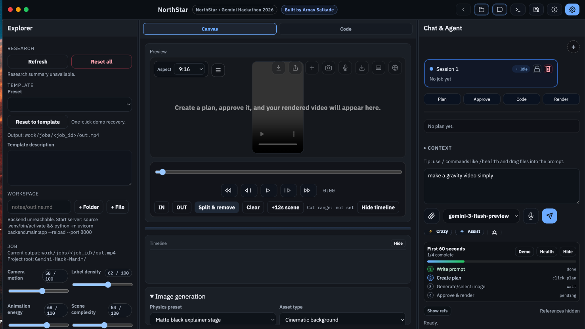

# NorthStar

NorthStar is an AI-native visual storytelling studio for science explainers.
Built by **Arnav Salkade**.

Turn a prompt into a rendered Manim video through an agentic workflow:
`Plan -> Approve -> Code -> Render`.

Project start date: **February 3, 2026**.

## Judge Note (Quick)

- Live UI demo: https://skill-deploy-c6ioczee1j-codex-agent-deploys.vercel.app
- Full Gemini + Manim rendering pipeline runs with the local backend (`python -m uvicorn backend.main:app --reload --port 8000`).
- Public code: https://github.com/Arnie016/Gemini-Hack-Manim

## What This App Does

- Generates scene plans with Gemini in structured JSON.
- Converts approved plans into Manim Python (`GeneratedScene`) code.
- Renders MP4 videos with Manim locally.
- Supports one-pass repair if render fails.
- Generates optional background/foreground images (Nano Banana model path).
- Lets users drag and drop assets, files, snippets, and indexed source context into prompts or timeline scenes.
- Provides editable timeline scenes and editable code pane (with save + re-render).

## Why Gemini Is Central

Gemini is not just used for text generation. It drives:

1. Scene reasoning and pacing in structured plan output.
2. Code synthesis from approved plan + constraints.
3. Repair loop using runtime logs.
4. Skill generation and source indexing summaries (including YouTube/web links).

## Major Upgrades Implemented

### 1) Agentic IDE-Style Workflow
- Three-panel interface: Explorer, Canvas, Chat.
- Plan/Approve/Code/Render stages with progress states.
- Real-time render state polling + event streaming.

### 2) Stronger Workspace System
- File/folder create, rename, delete.
- Double-click rename support.
- Tree selection highlighting.
- Generated scene code is persisted per job.

### 3) Timeline + Scene Authoring
- Scene blocks with durations and drag-reorder.
- Inline editing for scene goal, notes, and seconds.
- Drag/drop assets and context directly into scenes.
- One-click append flow: add a next scene segment and stitch videos.

### 4) Context, Skills, and Sources
- Memory blocks for reusable facts.
- Skills library + @mention chips.
- Docs indexer (`/api/docs/index`) for web/YouTube links.
- Indexed summaries can be dropped into prompt/timeline.

### 5) Rendering and Reliability
- Health checks for Manim/ffmpeg/Python path.
- Better prompt guards for common Manim mistakes.
- Repair route for failed renders.
- Project autosave and layout persistence.

## Architecture

- `backend/main.py`: FastAPI API routes and orchestration.
- `backend/gemini_http.py`: raw Gemini REST calls (`generateContent`).
- `backend/prompts.py`: plan/code/repair prompt contracts.
- `backend/file_store.py`: workspace file system operations.
- `backend/renderer.py`: Manim render invocation.
- `web/index.html`: full IDE-like frontend.
- `work/jobs/<job_id>/`: per-job outputs.

## Output Paths

Each run writes artifacts under:

`work/jobs/<job_id>/`

Common files:
- `plan.json`
- `scene.py`
- `out.mp4`
- `logs.txt`
- `state.json`
- `events.log`
- `assets/` (if images are generated/uploaded)

User workspace files are under:
- `work/user_files/...`

Generated scene code snapshots are also saved under:
- `notes/generated/<job_id>/scene.py`

## Local Setup (macOS)

```bash
cd "/Users/hema/Desktop/Gemini-Hack-Manim"
python3 -m venv .venv
source .venv/bin/activate
python -m pip install -U pip
python -m pip install -r requirements.txt
python -m pip install manim
brew install ffmpeg
```

Set API key:

```bash
export GEMINI_API_KEY="YOUR_KEY"
```

Run app:

```bash
python -m uvicorn backend.main:app --reload --port 8000
```

Open:
- http://127.0.0.1:8000

## Quick Health Checks

```bash
source .venv/bin/activate
python -m manim --version
ffmpeg -version
```

## API Surface (Core)

- `GET /api/templates`
- `POST /api/plan`
- `POST /api/approve`
- `GET /api/jobs/{job_id}`
- `GET /api/jobs/{job_id}/events`
- `POST /api/jobs/append`
- `POST /api/render-code`
- `POST /api/images/generate`
- `POST /api/jobs/upload-asset`
- `POST /api/docs/index`
- `GET/POST/DELETE /api/memories`
- `GET/POST/DELETE /api/skills`
- `POST /api/skills/generate`
- `GET/POST /api/settings`
- `GET /api/health`
- `GET/POST/PUT/DELETE /api/files...`

## Demo Flow (3 Minutes)

1. Enter prompt in chat.
2. Click **Create plan**.
3. Optionally click **Generate images** and drag into timeline scenes.
4. Edit plan/timeline/code if needed.
5. Click **Approve & Render**.
6. Show output MP4 and downloadable artifacts.

## Hackathon Positioning

This project is aimed at:
- Educational storytelling at social-video speed.
- Human-in-the-loop creative control.
- Transparent AI pipeline (plan + code + render artifacts).

## Product Name

This project is now named **NorthStar**.

## Credits

- **3Blue1Brown (Grant Sanderson)**: original creator of Manim and the foundational visual style that inspired this work.
- **Manim Community**: ongoing open-source development and maintenance of Manim Community Edition used by this app.

## Notes

- This app expects a running Python backend for file operations, rendering, and indexing.
- If UI actions show “Failed to reach backend”, ensure Uvicorn is running at the same host/port you opened.
- Browser extension console errors are usually external and not from this app.
