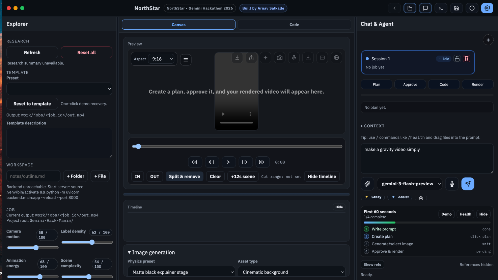

# NorthStar

NorthStar is an agentic IDE for Manim storytelling animations. It turns one
prompt into a scene plan, lets you audit/edit the plan, generates Manim code,
renders the animation, and attempts a repair pass when rendering fails:
`Plan -> Audit -> Approve -> Code -> Render -> Repair`.

Built by **Arnav Salkade**.

## Links
- Demo UI: https://skill-deploy-c6ioczee1j-codex-agent-deploys.vercel.app
- Repo: https://github.com/Arnie016/Gemini-Hack-Manim

## Model providers
- OpenAI is the default text provider for planning, code generation, diagnosis, and repair.
- Gemini is still supported as an alternate text provider and for Gemini image generation.
- The IDE stores provider/model settings locally through the Settings panel.

## Run (local backend)
```bash
cd Gemini-Hack-Manim
python3 -m venv .venv && source .venv/bin/activate
brew install cairo pango pkg-config ffmpeg
python -m pip install -U pip -r requirements.txt
export OPENAI_API_KEY="YOUR_KEY"
# Optional: export GEMINI_API_KEY="YOUR_KEY" for Gemini text or image generation.
python -m uvicorn backend.main:app --reload --port 8000
```

Open `http://127.0.0.1:8000` for the landing page or `http://127.0.0.1:8000/app` for the IDE.  
Output files: `work/jobs/<job_id>/`  
Credits: Manim by Grant Sanderson (3Blue1Brown) + Manim Community.

## CLI
Run the same NorthStar pipeline from the terminal:

```bash
# Optional first-run guide: asks what you make and recommends a command.
python -m backend.cli onboard

# Terminal 1: start the local backend
python -m backend.cli serve --reload

# Terminal 2: render a short MP4
python northstar.py render --seconds 30 --quality pql \
  "30s high-school explainer: two waves combine into one resultant."

# Inspect an existing job, or watch it with animated progress in a TTY
python northstar.py status <job_id>
python northstar.py status <job_id> --watch --progress auto

# Create only the editable plan JSON
python northstar.py plan --out plan.json \
  "Explain the photoelectric effect in 45 seconds."

# Approve a saved plan and wait for the MP4
python northstar.py approve <job_id> --plan-file plan.json --wait

# Add OpenAI voiceover to a rendered job
python northstar.py voiceover <job_id> --provider openai --voice marin --draft-script
```

The CLI uses `NORTHSTAR_URL` when set, otherwise `http://127.0.0.1:8000`.
It stores its anonymous render-credit cookie at `~/.northstar/cookies.json` so
CLI renders use the same local billing/session flow across commands.

Render polling writes progress to stderr and final structured JSON to stdout, so
the CLI still works in scripts. Use `--progress animate` to force the physics
spinner, `--progress plain` for line-by-line status, or `--no-progress` for
quiet automation.

## Devpost tags
`gemini-api` `manim` `education` `edtech` `ai-video` `multimodal-ai` `fastapi` `python` `creator-tools` `scientific-visualization`
